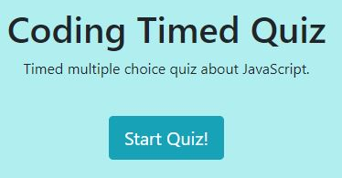
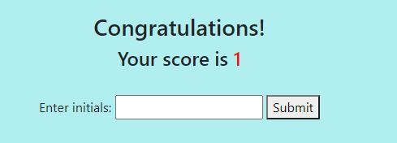
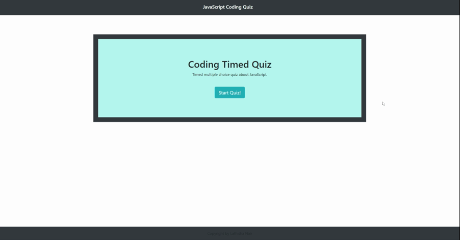

# HW4-WebAPI

## Description

- A timed quiz on Javascript that uses local storage to save highscores.

---
## Technologies Used:

1. HTML
2. CSS
3. Javascript
4. Twitter Bootstrap
5. ScreentoGif

---
## Essential Code

- The start button is an essential part of the quiz. When clicked, it shows questions and answers but it also starts the timer at 60 seconds. As the user picks their choices, it will automatically move to the next question.

- The user finishes the quiz and will be presented with this page. It will show them their score, which is the questions they got correct, and will be able to enter their initials for the highscore list.

---
## Gif Walkthrough

---

[Link to Webpage](https://lnair1997.github.io/HW4-WebAPI/)